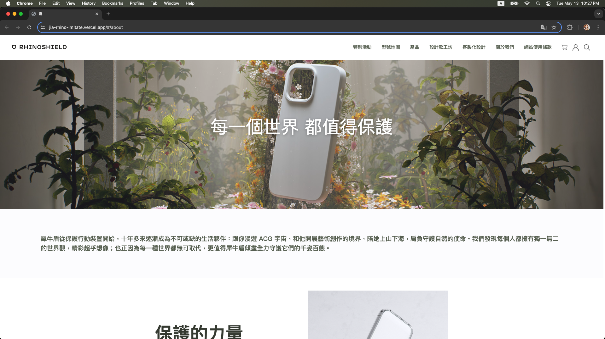
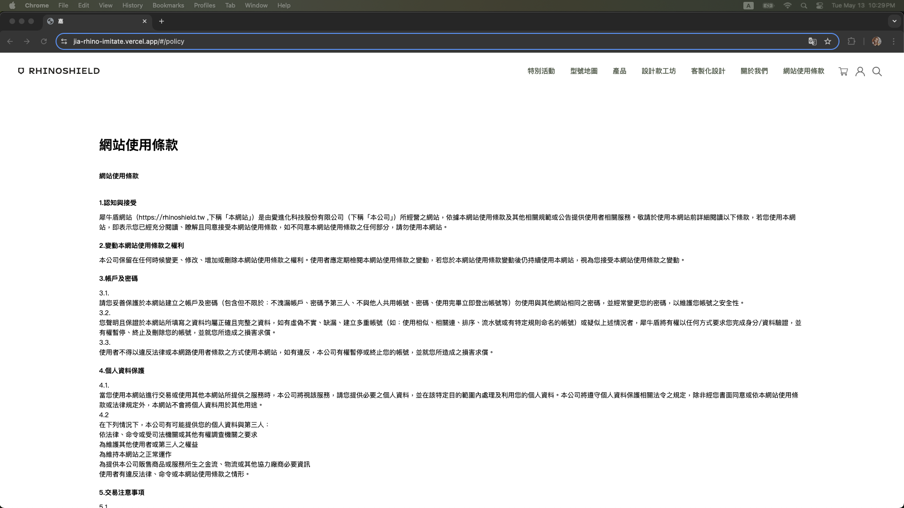
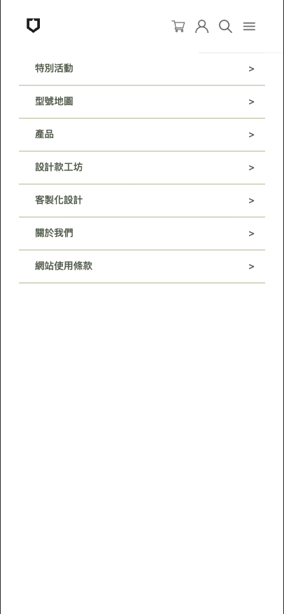
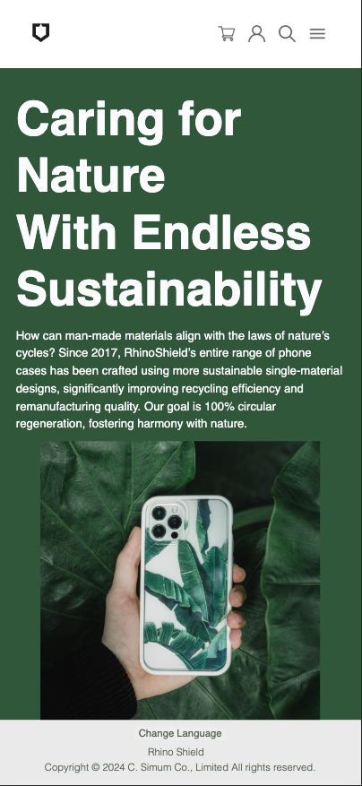

# 🦏 Jia Rhino Imitate - 仿犀牛盾官方網站

本專案仿製 **犀牛盾（RhinoShield）官方網站** 的「關於我們」與「網站使用條款」頁面，支援中英文切換、響應式設計，並可於開發者工具中檢視 `LocalStorage` 中的使用者資料。

此專案目的為練習多語系切換、響應式網頁設計、React 路由切換與本地儲存等前端技術。

---

## 🚀 安裝方式

```bash
git clone https://github.com/jiawu777/jia-rhino-imitate.git
cd jia-rhino-imitate
npm install
```

## 📘 使用方式

- 可切換「**關於我們**」、「**網站使用條款**」頁籤

- 可使用開發者工具檢視 `userInfo` 資料：

  1. 滑鼠右鍵點選 `Inspect`
  2. 點選右上橫列中的「**Application**」頁籤
  3. 左側直行點擊：`LocalStorage → https://jia-rhino-imitate.vercel.app/`

- 切換裝置模式（手機／平板顯示）：

  1. 滑鼠右鍵點選 `Inspect`
  2. 點選右上橫列左側數來第二個圖標（裝置切換）

- 語系切換：

  - **手機／平板模式**：頁面最下方可切換語系
  - **電腦模式**：右下角可切換語系
  - 可點選「**Change Language**」按鈕切換中英文

- **手機／平板模式** 的 Header 隱藏於右上角選單圖示，點擊即可展開側邊選單

---

## 🌐 部署連結

🔗 [https://jia-rhino-imitate.vercel.app/](https://jia-rhino-imitate.vercel.app/)

---

## 🛠 技術棧

- 💻 **React + TypeScript**
- ⚡ **Vite**
- 🎨 **SCSS**
- 🌍 **i18next**（中英多語系切換）
- 🧭 **React Router**（分頁導覽）
- 💾 **LocalStorage**（使用者資料儲存）

---

## 📸 頁面截圖

### 🌟 首頁頁面（About us）



### 📜 網站使用條款



### 📱 手機模式側邊選單



### 🌐 中英切換功能


